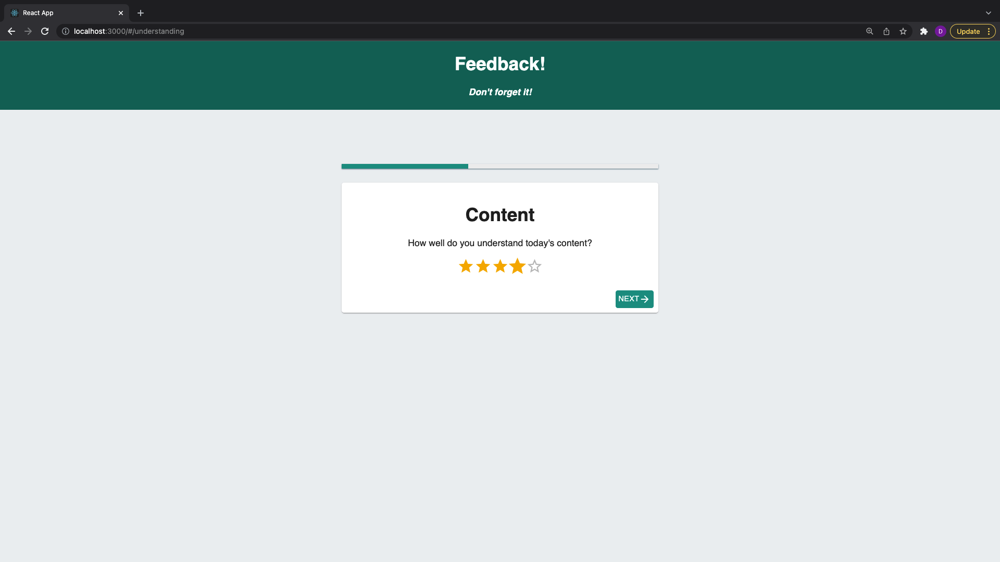

# Student Feedback Form

## Description
This application is a student feedback form that features a series of pages users are directed to as each section of the form is completed.

### Instructions 
Follow the prompts on the screen to provide feedback. There is a review page at the end of the form to review feedback given.

### Duration 

The total duration of the project was roughly ~16 hours. 

### What problem was solved? 

The task at hand was to create a feedback form that relied on Redux for storing information. Many factors had to be considered to ensure the app, along with its children components, were communicating efficiently and effectively with Redux and changing state as actions were defined and taking place.

Below are a few steps I took to ensure project satisfaction: 

- Sketch wireframes for each section of the form to establish visual idea of end product
- Set up server and database and test API endpoints using Postman
- Configure each component (with corresponding route) as a page related to the form
- Set up reducers in Redux and test connection with the App
- Add form elements into each section of the form (ex: input fields)
- Stylize form components using Material UI and ensure brand is consistent between pages

## Wireframe

### Built with:
- Redux
- React
- Material UI
- Node.js
- postgreSQL  
- HTML5
- CSS3  

### Acknowledgement

This project is implemented into the curriculum taught at Prime Academy to strengthen our understanding of Redux as it relates to the fullstack.